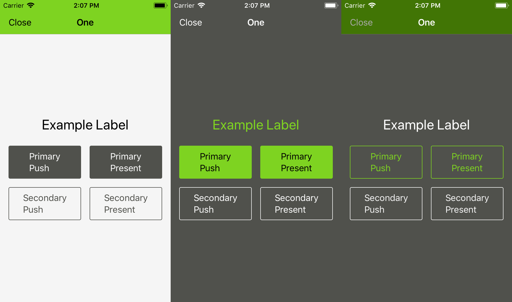

# Demo of `UIAppearance` proxy usage:

Displays the same `ViewController` in three different styles depending on what type of `UINavigationController` it is presented in.

Demonstrates the most hacky way I could think of to globally remove the word 'Back' from navigation bars.

Globally enables dynamic text resizing on all labels in an app.

